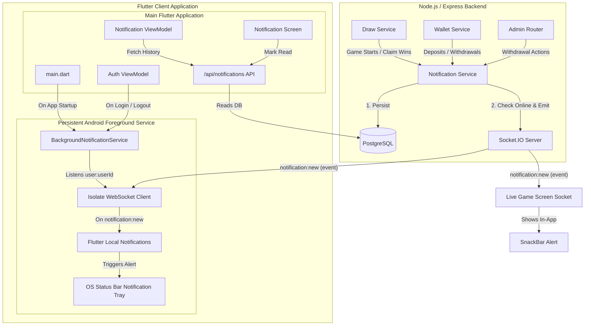

# Lootlo Push Notification System: Architecture & Workflow Guide

This document provides a comprehensive overview of the self-hosted push notifications architecture and step-by-step workflow implemented in **Lootlo**. 

Since this system does not rely on third-party push gateways (such as Google FCM or OneSignal), it uses a **hybrid persistent-storage and real-time Socket.IO synchronization service** to deliver notifications both inside the app and directly to the OS system tray.

---

## 1. System Architecture

The following diagram illustrates how notifications are triggered by the backend, persisted in the database, broadcasted over WebSockets, and received by the Flutter client's main UI thread and background foreground service.



---

## 2. Database Schema Definition

All user notifications are stored persistently in the database so history is preserved. The schema is defined in [schema.prisma](file:///c:/Users/offic/OneDrive/Desktop/lootlo-app/backend/prisma/schema.prisma):

```prisma
model Notification {
  id        String           @id @default(uuid())
  userId    String
  user      User             @relation(fields: [userId], references: [id], onDelete: Cascade)
  type      NotificationType
  title     String
  body      String
  data      Json?            // Contextual data (e.g. gameId, transactionId)
  isRead    Boolean          @default(false)
  createdAt DateTime         @default(now())

  @@index([userId])
  @@index([createdAt])
}

enum NotificationType {
  game_started
  game_starting_soon
  pattern_won
  winnings_credited
  withdrawal_approved
  withdrawal_rejected
  system_message
  new_game_announced
}
```

---

## 3. Backend Workflow

The core backend operations are managed inside [notification.service.ts](file:///c:/Users/offic/OneDrive/Desktop/lootlo-app/backend/src/notification/notification.service.ts).

### Step 3.1: Triggering the Notification
When a business event occurs, the backend triggers either a targeted notification or a bulk notification:

* **Single Target Notification**:
  ```typescript
  await sendNotification({
    userId: "user_uuid_123",
    type: "winnings_credited",
    title: "Wallet Top-up Successful",
    body: "₹500 has been credited to your wallet.",
    data: { transactionId: "tx_999" }
  });
  ```
* **Bulk Notifications** (e.g., notifying all players who purchased tickets when a game goes live):
  ```typescript
  await sendBulkNotification(
    ["user_1", "user_2", "user_3"],
    "game_started",
    "Game is Live!",
    "Tap here to join the tambola draw now."
  );
  ```

### Step 3.2: Persistence and Socket Delivery
Inside `sendNotification()`, the backend executes two steps:
1. **DB Persistence**: Saves the notification to the database so that when the user logs in, pulls to refresh, or starts the app, they see their message history.
2. **Real-time Push**: Emits `notification:new` to the Socket.IO room `user:${userId}`. When a user connects to the socket server, they join a private room designated by their user ID.

---

## 4. Frontend Client Isolate Separation

Flutter running on Android/iOS uses an isolate-based concurrency model. Because background code executes in a completely separate Dart environment, our notification system is split into two isolates: **UI Isolate** and **Background Isolate**.

### A. The UI Isolate (Main Thread)
* **Start up Registration** ([main.dart](file:///c:/Users/offic/OneDrive/Desktop/lootlo-app/live_housie/lib/main.dart)): Initializes the background configuration and requests native permissions (e.g. `POST_NOTIFICATIONS` on Android 13+).
* **Credential Sync** ([auth_viewmodel.dart](file:///c:/Users/offic/OneDrive/Desktop/lootlo-app/live_housie/lib/features/auth/viewmodels/auth_viewmodel.dart)): 
  * On successful login, registrations, or on app startup, the main isolate reads `userId` and `accessToken` and forwards them to the background service using `BackgroundNotificationService.sendCredentials(userId, token)`.
  * On logout, it calls `sendCredentials(null, null)`, telling the background listener to disconnect and standby.
  * **This architecture prevents database lock conflicts because the background service does not open Hive while the UI thread is active.**

### B. The Background Isolate (Foreground Service)
* **Foreground Service Running** ([background_notification_service.dart](file:///c:/Users/offic/OneDrive/Desktop/lootlo-app/live_housie/lib/data/services/background_notification_service.dart)): The app runs a persistent foreground listener (`flutter_background_service`) that keeps a sticky notification in the status bar tray. This tells the Android OS that the app is active and prevents it from killing our websocket connection.
* **Background Isolate Entrypoint (`onStart`)**:
  * Registers listeners for credentials.
  * Spawns a dedicated background instance of `WebSocketService`.
  * Automatically connects to the server and calls `emit('join', 'user:$userId')`.
  * When `'notification:new'` event is received, it executes `_showSystemNotification(title, body)`.
  * Spawns a native status tray alert using `flutter_local_notifications` with `Importance.max` and `Priority.high`.

---

## 5. UI Notification Interactions

### Badge Indicators & List View
* **Badge updates** ([notification_viewmodel.dart](file:///c:/Users/offic/OneDrive/Desktop/lootlo-app/live_housie/lib/features/notification/viewmodels/notification_viewmodel.dart)): 
  * Keeps the unread status in a Riverpod `Notifications` notifier.
  * `unreadNotificationsCountProvider` watches the notifier, showing the count dynamically on the bell icon badge.
* **Notification History** ([notification_screen.dart](file:///c:/Users/offic/OneDrive/Desktop/lootlo-app/live_housie/lib/features/notification/views/notification_screen.dart)):
  * Displays notifications grouped chronologically.
  * Provides visual mapping (icons & colors) for different notification types.
  * Tapping a single notification immediately marks it read via API call `PATCH /api/notifications/:id`.

### Contextual Deep-Linking Routing
Tapping notifications inside the history screen (or clicking on in-app SnackBars) automatically forwards users to the relevant screens in [app_router.dart](file:///c:/Users/offic/OneDrive/Desktop/lootlo-app/live_housie/lib/core/routing/app_router.dart):

| Notification Type | Target Payload Context | Screen Destination Router Path |
| :--- | :--- | :--- |
| `game_started` / `game_live` | `gameId` | Live Game Arena (`/games/:gameId/live`) |
| `pattern_won` / `new_game_announced` | `gameId` | Game Details (`/games/:gameId`) |
| `winnings_credited` / `withdrawal_approved` | - | Wallet screen (`/wallet`) |
| `withdrawal_rejected` / `system_message` | - | Wallet screen (`/wallet`) |

---

## 6. Android Configuration Requirements

To guarantee delivery on Android, the [AndroidManifest.xml](file:///c:/Users/offic/OneDrive/Desktop/lootlo-app/live_housie/android/app/src/main/AndroidManifest.xml) is configured with:

1. **System Permissions**:
   ```xml
   <uses-permission android:name="android.permission.POST_NOTIFICATIONS"/>
   <uses-permission android:name="android.permission.FOREGROUND_SERVICE"/>
   <uses-permission android:name="android.permission.FOREGROUND_SERVICE_DATA_SYNC"/>
   <uses-permission android:name="android.permission.WAKE_LOCK"/>
   ```
2. **Foreground Service Declarations**:
   The background service is registered inside the `<application>` tag specifying the `dataSync` service type to pass Android 14+ security checks, along with a `tools:replace` attribute to resolve plugin conflicts:
   ```xml
   <service
       android:name="id.flutter.flutter_background_service.BackgroundService"
       android:enabled="true"
       android:exported="false"
       android:foregroundServiceType="dataSync"
       tools:replace="android:exported" />
   ```
